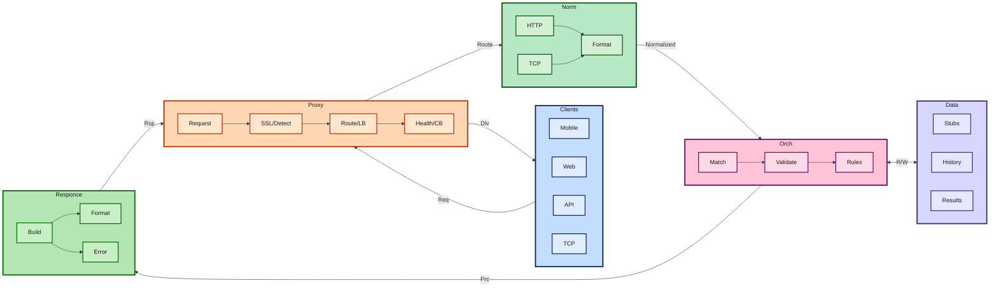

```mermaid
flowchart LR

%% ========== CLIENT SECTION ==========
subgraph CLIENTS["Clients"]
    direction LR
    C1["Mobile"]
    C2["Web"]
    C3["API"]
    C4["TCP"]
end

%% ========== PROXY SECTION ==========
subgraph PROXY["Proxy"]
    direction LR
    P1["Request"]
    P2["SSL/Detect"]
    P3["Route/LB"]
    P4["Health/CB"]
    P1 --> P2 --> P3 --> P4
end

%% ========== NORMALIZATION ==========
subgraph NORM["Norm"]
    direction LR
    N1["HTTP"]
    N2["TCP"]
    N3["Format"]
    N1 & N2 --> N3
end

%% ========== ORCHESTRATION ==========
subgraph ORCH["Orch"]
    direction LR
    O1["Match"]
    O2["Validate"]
    O3["Rules"]
    O1 --> O2 --> O3
end

%% ========== DATA STORE ==========
subgraph STORE["Data"]
    direction LR
    S1["Stubs"]
    S2["History"]
    S3["Results"]
end

%% ========== RESPONSE SECTION ==========
subgraph RESPONSE["Responce"]
    direction LR
    R1["Build"]
    R2["Format"]
    R3["Error"]
    R1 --> R2
    R1 --> R3
end

%% ========== MAIN FLOW ==========
CLIENTS -->|"Req"| PROXY
PROXY -->|"Route"| NORM
NORM -->|"Normalized"| ORCH
ORCH -->|"Prc"| RESPONSE
ORCH <-->|"R/W"| STORE
RESPONSE -->|"Rsp"| PROXY
PROXY -->|"Dlv"| CLIENTS

%% ========== STYLING ==========
style CLIENTS fill:#c4dcff,stroke:#001f5f,stroke-width:3px,color:#1a1a1a
style PROXY fill:#ffd8b3,stroke:#b32d00,stroke-width:3px,color:#1a1a1a
style NORM fill:#b7e8c6,stroke:#004d00,stroke-width:3px,color:#1a1a1a
style ORCH fill:#ffc4d8,stroke:#660066,stroke-width:3px,color:#1a1a1a
style STORE fill:#d6d6ff,stroke:#2f2f6b,stroke-width:3px,color:#1a1a1a
style RESPONSE fill:#b3e6b3,stroke:#006600,stroke-width:3px,color:#1a1a1a

classDef clientNode fill:#e0ecff,stroke:#001f5f,stroke-width:2px,color:#1a1a1a
classDef proxyNode fill:#ffe6cc,stroke:#b32d00,stroke-width:2px,color:#1a1a1a
classDef normNode fill:#d4f0d4,stroke:#004d00,stroke-width:2px,color:#1a1a1a
classDef orchNode fill:#ffd9e6,stroke:#660066,stroke-width:2px,color:#1a1a1a
classDef storeNode fill:#e6e6ff,stroke:#2f2f6b,stroke-width:2px,color:#1a1a1a
classDef responseNode fill:#c7f0c7,stroke:#006600,stroke-width:2px,color:#1a1a1a

class C1,C2,C3,C4 clientNode
class P1,P2,P3,P4 proxyNode
class N1,N2,N3 normNode
class O1,O2,O3 orchNode
class S1,S2,S3 storeNode
class R1,R2,R3 responseNode

```