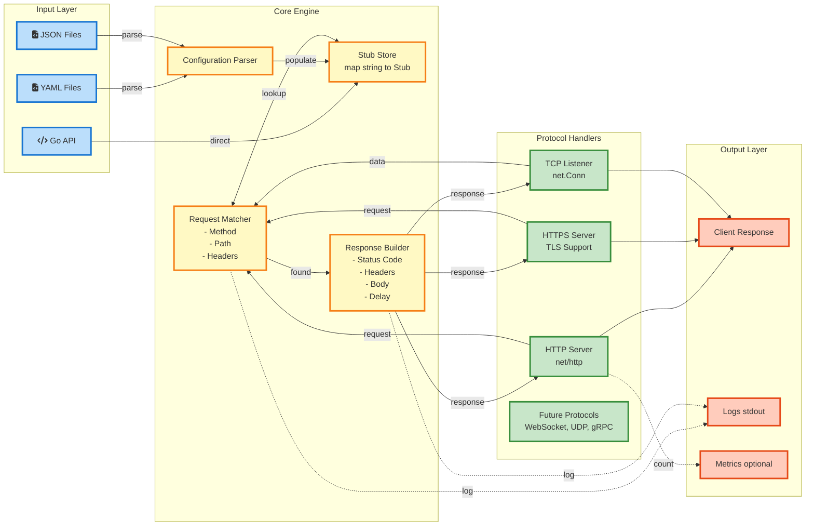

```mermaid
graph LR
    subgraph "Input Layer"
        I1[fa:fa-file-code YAML Files]
        I2[fa:fa-file-code JSON Files]
        I3[fa:fa-code Go API]
    end

    subgraph "Core Engine"
        direction TB
        C1[Configuration Parser]
        C2[Stub Store<br/>map string to Stub]
        C3[Request Matcher<br/>- Method<br/>- Path<br/>- Headers]
        C4[Response Builder<br/>- Status Code<br/>- Headers<br/>- Body<br/>- Delay]
    end

    subgraph "Protocol Handlers"
        P1[HTTP Server<br/>net/http]
        P2[HTTPS Server<br/>TLS Support]
        P3[TCP Listener<br/>net.Conn]
        P4[Future Protocols<br/>WebSocket, UDP, gRPC]
    end

    subgraph "Output Layer"
        O1[Client Response]
        O2[Logs stdout]
        O3[Metrics optional]
    end

    %% Connections
    I1 -->|parse| C1
    I2 -->|parse| C1
    I3 -->|direct| C2
    C1 -->|populate| C2

    P1 -->|request| C3
    P2 -->|request| C3
    P3 -->|data| C3

    C3 <-->|lookup| C2
    C3 -->|found| C4
    
    C4 -->|response| P1
    C4 -->|response| P2
    C4 -->|response| P3

    P1 --> O1
    P2 --> O1
    P3 --> O1

    C3 -.->|log| O2
    C4 -.->|log| O2
    P1 -.->|count| O3

    %% Styling
    classDef inputStyle fill:#bbdefb,stroke:#1976d2,stroke-width:3px
    classDef coreStyle fill:#fff9c4,stroke:#f57f17,stroke-width:3px
    classDef protocolStyle fill:#c8e6c9,stroke:#388e3c,stroke-width:3px
    classDef outputStyle fill:#ffccbc,stroke:#e64a19,stroke-width:3px

    class I1,I2,I3 inputStyle
    class C1,C2,C3,C4 coreStyle
    class P1,P2,P3,P4 protocolStyle
    class O1,O2,O3 outputStyle
```
