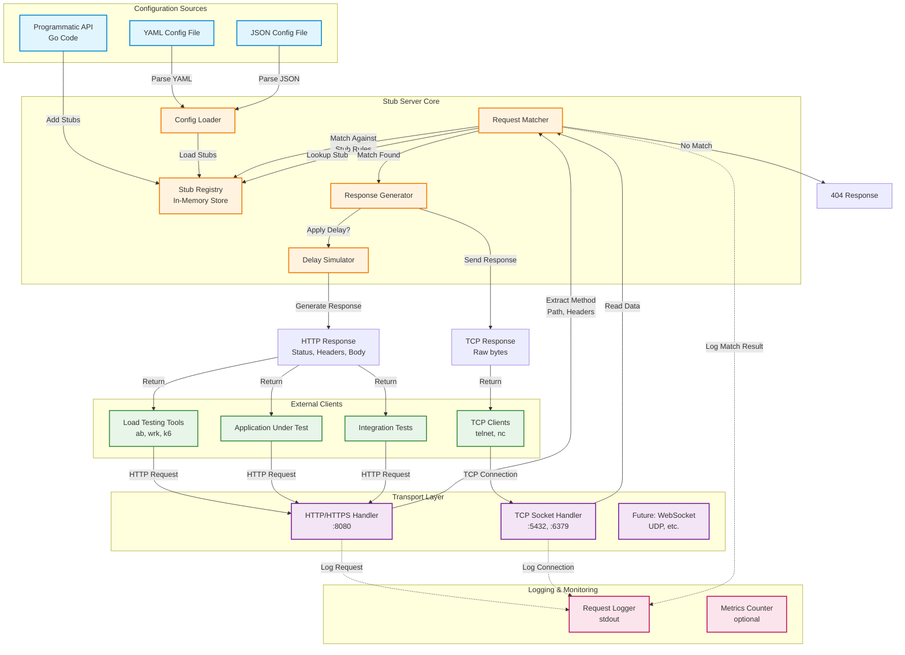

```mermaid
 graph TB
    subgraph "Configuration Sources"
        A1[YAML Config File]
        A2[JSON Config File]
        A3[Programmatic API<br/>Go Code]
    end

    subgraph "Stub Server Core"
        B1[Config Loader]
        B2[Stub Registry<br/>In-Memory Store]
        B3[Request Matcher]
        B4[Response Generator]
        B5[Delay Simulator]
    end

    subgraph "Transport Layer"
        C1[HTTP/HTTPS Handler<br/>:8080]
        C2[TCP Socket Handler<br/>:5432, :6379]
        C3[Future: WebSocket<br/>UDP, etc.]
    end

    subgraph "External Clients"
        D1[Load Testing Tools<br/>ab, wrk, k6]
        D2[Application Under Test]
        D3[Integration Tests]
        D4[TCP Clients<br/>telnet, nc]
    end

    subgraph "Logging & Monitoring"
        E1[Request Logger<br/>stdout]
        E2[Metrics Counter<br/>optional]
    end

    %% Configuration flow
    A1 -->|Parse YAML| B1
    A2 -->|Parse JSON| B1
    A3 -->|Add Stubs| B2
    B1 -->|Load Stubs| B2

    %% Request flow - HTTP
    D1 -->|HTTP Request| C1
    D2 -->|HTTP Request| C1
    D3 -->|HTTP Request| C1
    
    C1 -->|Extract Method<br/>Path, Headers| B3
    
    B3 -->|Match Against<br/>Stub Rules| B2
    B3 -->|No Match| F1[404 Response]
    B3 -->|Match Found| B4
    
    B4 -->|Apply Delay?| B5
    B5 -->|Generate Response| G1[HTTP Response<br/>Status, Headers, Body]
    
    G1 -->|Return| D1
    G1 -->|Return| D2
    G1 -->|Return| D3

    %% Request flow - TCP
    D4 -->|TCP Connection| C2
    C2 -->|Read Data| B3
    B3 -->|Lookup Stub| B2
    B4 -->|Send Response| G2[TCP Response<br/>Raw bytes]
    G2 -->|Return| D4

    %% Logging
    C1 -.->|Log Request| E1
    C2 -.->|Log Connection| E1
    B3 -.->|Log Match Result| E1
    
    %% Styling
    classDef configStyle fill:#e1f5ff,stroke:#0288d1,stroke-width:2px
    classDef coreStyle fill:#fff3e0,stroke:#f57c00,stroke-width:2px
    classDef transportStyle fill:#f3e5f5,stroke:#7b1fa2,stroke-width:2px
    classDef clientStyle fill:#e8f5e9,stroke:#388e3c,stroke-width:2px
    classDef logStyle fill:#fce4ec,stroke:#c2185b,stroke-width:2px
    
    class A1,A2,A3 configStyle
    class B1,B2,B3,B4,B5 coreStyle
    class C1,C2,C3 transportStyle
    class D1,D2,D3,D4 clientStyle
    class E1,E2 logStyle
```
